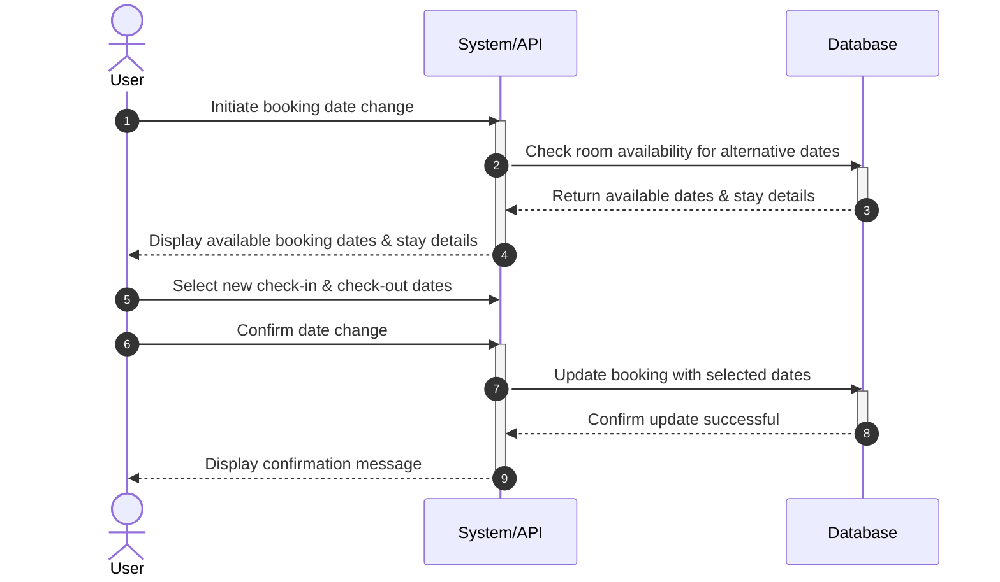

# Feature: Active booking managing
## Use Case: Change the dates 

Main actors: user, API/system, database.
Main scenario: change the dates of an active booking. 

```mermaid
sequenceDiagram
    autonumber
    actor User as User
    participant System as System/API
    participant DB as Database

    User->>System: Initiate booking date change
    activate System
    System->>DB: Check room availability for alternative dates
    activate DB
    DB-->>System: Return available dates & stay details
    deactivate DB
    System-->>User: Display available booking dates & stay details
    deactivate System

    User->>System: Select new check-in & check-out dates
    User->>System: Confirm date change
    activate System
    System->>DB: Update booking with selected dates
    activate DB
    DB-->>System: Confirm update successful
    deactivate DB
    System-->>User: Display confirmation message
    deactivate System
```
